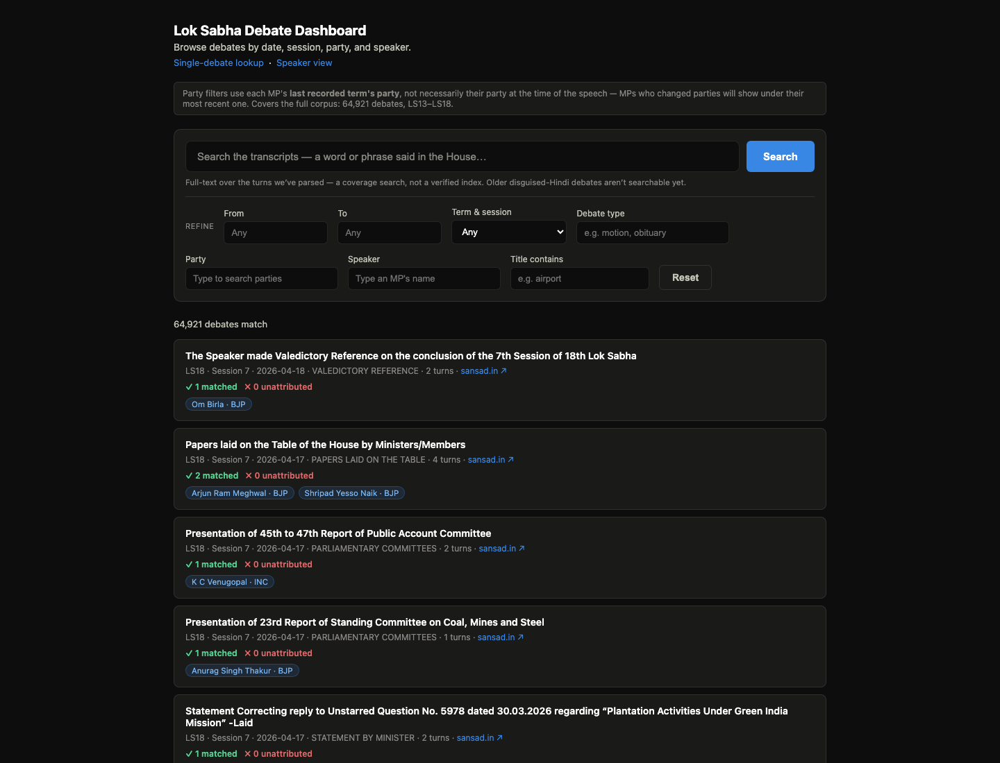
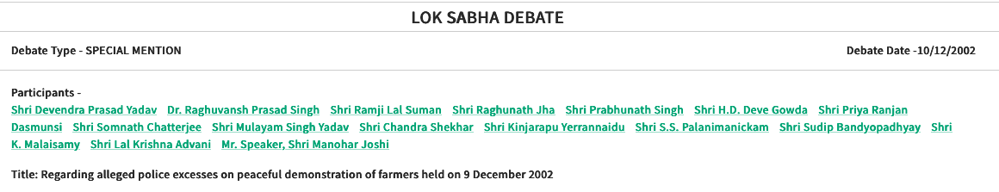
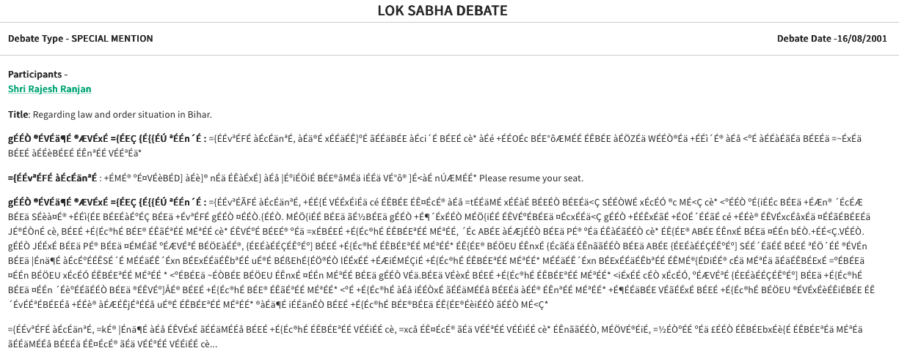
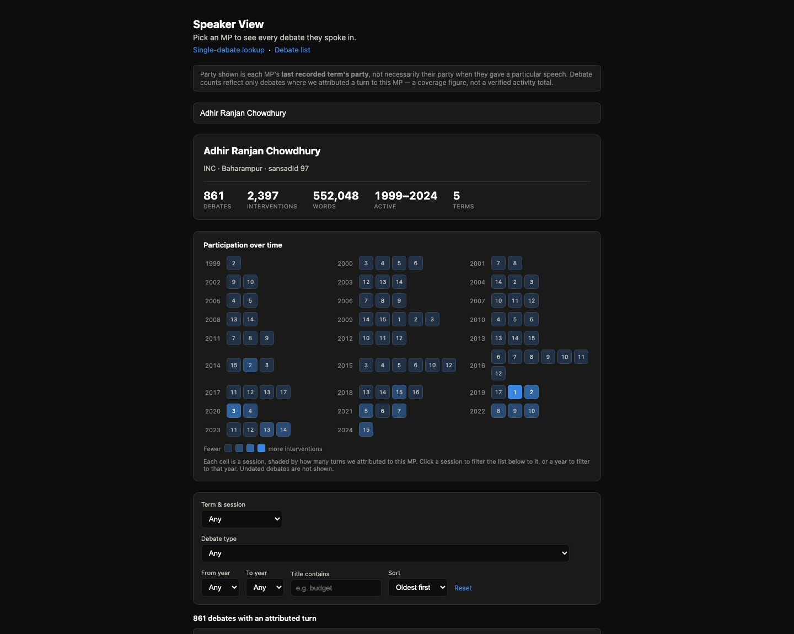

# Torko

Torko lets a user search 64,921 Lok Sabha debates from 1999 to 2026 and find every speech by 2,072 identified members of parliament.



## The problem

The official website [sansad.in](https://sansad.in/ls/debates/digitized) publishes each Lok Sabha debate as a separate web page. The archive starts with the 13th Lok Sabha, in 1999. This is a major improvement from erstwhile PDF-only versions of debates (available on [eparlib](https://elibrary.sansad.in/collections/b2770639-c57b-4ba3-a9f1-57761c60d195) site)

At first view, the data looks well structured and machine-readable. Each speaker has a unique identity number. Each debate lists the members who took part. A researcher could expect to list every intervention by one member.

A closer look shows four problems.

**1. The identity number appears only on a member's first turn in a debate.** Later turns carry only a printed name. The same person also appears under many spellings, for example `SHRI ADHIR RANJAN CHOWDHURY (BAHARAMPUR)`, `SHRI ADHIR RANJAN CHOWDHURY`, and `श्री अधीर रंजन चौधरी`.

**2. One number can name different ministers.** A minister who is not a Lok Sabha member gets a temporary number for one term. A later term gives the same number to a different person. For example, `10008` is Anbumani Ramadoss in LS14 (2004 to 2009) and Ravi Shankar Prasad in LS16 (2014 to 2019).

**3. The list of participants is incomplete.** There are numerous cases where interventions of a speaker are left untagged altogether. In this [2002 debate](https://sansad.in/ls/debates/view-debate?ls=13&session=11&dbslno=4930), Tarit Baran Topdar speaks 3 times. The list of participants does not include his name. So sansad.in does not link this debate to him. Torko finds all 3 turns and links them to him.



**4. Old Hindi text is unreadable.** Debates before about 2009 store Hindi in a pre-Unicode font inside the source HTML. The text shows as random Latin characters. See [this 2001 debate](https://sansad.in/ls/debates/view-debate?ls=13&session=7&dbslno=2890) for an example.



## What Torko does

- Search 26+ years (1999 - 2026) of debates by word or by phrase.
- Filter debates by party, by parliament term, by year, and by category.
- Open a member of parliament and read every speech from that member.
- Open the official source page for any speech, with one click.

## Terms used in this project

This table defines the terms that this project uses.

| Term                  | Meaning                                                                                                                                   | Example                                                          |
| --------------------- | ----------------------------------------------------------------------------------------------------------------------------------------- | ---------------------------------------------------------------- |
| **Lok Sabha**         | The lower house of India's parliament.                                                                                                    |                                                                  |
| **Term**              | One elected Lok Sabha, about 5 years long. Torko covers the 13th to the 18th term.                                                        | LS17 = June 2019 to February 2024                                |
| **Session**           | One sitting period inside a term. A term has about 15 sessions.                                                                           | LS18, Session 7                                                  |
| **Debate**            | One item of business on one day. sansad.in publishes each debate as a separate page. <br><br>There can be multiple debates on a given day | "Papers laid on the Table", 17 April 2026                        |
| **Speaker label**     | The name text printed above a block of speech on the sansad.in website.                                                                   | `SHRI ADHIR RANJAN CHOWDHURY (BAHARAMPUR)`                       |
| **Member**            | A specific person who sat in the Lok Sabha. <br><br>Torko gives each member one permanent identity across all terms.                      | Adhir Ranjan Chowdhury                                           |
| **Member ID**         | The number that sansad.in gives each member. The number stays the same across terms.                                                      | `97`                                                             |
| **Turn**              | One unbroken block of text under one speaker label. A debate is a list of turns. A turn is the smallest unit of a debate.                 | One reply between two interruptions counts as a turn.            |
| **Speech**            | One continuous contribution by one member. We stitch together a member's turns across short interruptions to create a speech.             | A 90-minute reply with 40 interruptions is 1 speech and 41 turns |
| **Interjection**      | A short turn from another member inside someone's speech. A remark of 25 words or fewer does not end the speech.                          | "Sir, that is not correct."                                      |
| **Presiding officer** | The person in the chair, such as the Speaker or the Deputy Speaker. sansad.in prints the office, not the name.                            | `MR. SPEAKER`                                                    |
| **Attributed turn**   | A turn that Torko links to one member successfully.                                                                                       |                                                                  |
| **Unattributed turn** | A turn that Torko cannot link to one member conclusively. Torko leaves the name blank. It does not guess.                                 |                                                                  |
| **Debate category**   | The type of business that sansad.in assigns to each debate. There are 76 categories.                                                      | `MATTERS UNDER RULE-377`                                         |
| **Topic tag**         | A subject keyword that sansad.in attaches to a debate. 70.5% of debates have one or more tags.                                            | `Coastal Areas`                                                  |
| **Old-font Hindi**    | Hindi text in debates before about 2009, stored in a pre-Unicode font. It looks like broken Latin letters until Torko decodes it.         | `gÉÉÒ` = श्री                                                    |

## Run it

Follow these steps to run Torko locally:

```bash
python3 -m venv .venv
source .venv/bin/activate
pip install -r requirements.txt
```

Copy the example environment file and set a database password.

```bash
cp .env.example .env
```

Start the database with this command.

```bash
docker compose up -d
```

### Load the data

The database starts empty. Run these five commands one time, in this order.

```bash
python3 scripts/load_roster.py
python3 -u scripts/import_debates.py
python3 -u scripts/populate_turns.py
python3 -u scripts/populate_speeches.py
python3 scripts/analyze_speeches.py > fixtures/analysis.json
```

The first script loads the member roster from the sansad.in API.
The second script downloads all 64,921 debates.
This step takes under one hour with the default 6 workers.
The third script reads the stored HTML and writes the speaking turns.
The fourth script groups the turns into speeches.
The fifth command rebuilds the data for the corpus statistics page.

Start the web server with this command.

```bash
source .venv/bin/activate && set -a && source .env && set +a && python3 server.py
```

Open the dashboard at this address: http://localhost:5050/dashboard.html

Torko also runs from the command line, on a single debate at a time.

```bash
python3 debate_fetch.py --loksabha 18 --session 3 --dbslno 1758
python3 debate_fetch_legacy.py --loksabha 13 --session 14 --dbslno 7793
```

Add the `--summary-only` flag to hide the per-turn previews.

## Screenshots


This image shows the profile page for one member of parliament.

## How it works

1. The reader fetches each debate from the sansad.in API.
2. Torko stores the raw HTML of the debate before it reads any text.
3. The reader extracts each speaking turn and writes it to PostgreSQL.
4. A Flask API, a Python web framework, serves the stored data to the front-end.

Torko is built with Python, PostgreSQL, SQLAlchemy Core, Flask, and plain JavaScript. SQLAlchemy Core is a Python toolkit for writing SQL queries.

Raw HTML is stored in the DB before any text is parsed out of that HTML. Thus, a change to the parsing logic does not need new network requests. A full re-read of all 64,921 debates takes minutes to complete, without any dependency on sansad.in.

Two reader files turn HTML into speaking turns. `debate_fetch.py` reads the recent format, used from the 15th to the 18th Lok Sabha. `debate_fetch_legacy.py` reads the old format, used in the 13th and 14th Lok Sabha. Torko detects the correct reader on its own, for each debate.

## Two engineering problems

**Problem 1: the disguised Hindi font.** Old pages store Hindi text in a font that predates Unicode, the modern standard for text encoding. The stored bytes look like broken Latin characters, for example `gÉÉÒ`. A reader that ignores this stores meaningless text while it reports success. Torko builds a character map to convert the bytes into real Hindi text. Torko also builds a detector. The detector decides whether the conversion should run. The detector matters because one early version of the fix once converted correct Hindi text into damaged text.

**Problem 2: one identity across 26 years.** The same person must carry one identity across all 6 parliament terms Torko covers. The source gives a stable identity number only on a speaker's first turn in each debate. Later turns carry just a printed name. Torko carries the identity number forward to later turns by comparing the printed names. Torko records no name when two different people could match the same printed name. A gap is safer than a wrong name.

Torko links all three spellings of Adhir Ranjan Chowdhury's name from the earlier example to one person record. That single record holds 861 debates and 2,397 interventions. It holds 552,048 words in total. The record spans 5 parliament terms, from 1999 to 2024.

## The numbers covered in the project

| Metric                                            | Value                                                                             |
| ------------------------------------------------- | --------------------------------------------------------------------------------- |
| Debates                                           | 64,921                                                                            |
| Date range                                        | 20 October 1999 to 18 April 2026                                                  |
| Parliament terms                                  | 6 (the 13th to the 18th Lok Sabha)                                                |
| Speaking turns                                    | 524,822                                                                           |
| Stitched speeches                                 | 172,877                                                                           |
| Members in the loaded roster                      | 2,177                                                                             |
| Members with at least one attributed turn         | 2,072                                                                             |
| Total words                                       | 78,253,636                                                                        |
| Words linked to a named person                    | 61,784,759 (79% of total words)                                                   |
| Turns with no identified speaker (chair excluded) | 111,286                                                                           |
| Speeches of 100 words or more with a named person | 97,043                                                                            |
| Debate categories                                 | 76                                                                                |
| Official topic tags                               | 6,976 distinct tags, on 70.5% of debates                                          |
| Average speech length                             | 415 words                                                                         |
| Longest single speech                             | 103,632 words                                                                     |
| Debates per term                                  | LS13: 7,616. LS14: 11,027. LS15: 11,216. LS16: 15,831. LS17: 13,272. LS18: 5,959. |


## Known limits

1. Torko finds no speaker name for 111,286 turns. The dashboard marks these turns as unattributed.
2. The party shown for a member reflects only their final term. A member who changed party shows one party for their whole history.
3. Torko does not read about 13.6% of the source text. The loss is 32.5% in the 13th Lok Sabha and about 3% in recent terms. Charts over time will therefore show too little activity in the early years.

   <details>
   <summary>Why?</summary>

   Each reader collects text only from paragraph tags (`<p>`). Many source pages have broken HTML. A `<p>` tag opens but never closes. The HTML library then closes that tag early. The rest of the speech sits outside any paragraph, under a `<font>` tag or directly under `<body>`. The readers do not look there, so that text is lost.

   </details>

## Next steps

**1. Semantic search.** Today, search matches exact words. The next step is search by meaning. A query such as "water scarcity in rural districts" will also find speeches that use other words for the same idea. Each speech of 100 words or more will be converted into an embedding. There are 97,043 such speeches. PostgreSQL will store the embeddings with the `pgvector` extension. One query will combine meaning, exact words, and filters such as party and year. Each result will link to the official source.

**2. AI topic tags.** sansad.in tags a whole debate, not a single speech. One large debate can carry 59 tags, and most of them do not apply to any single speech in it. Some topics also have no tag at all. For example, members discuss jallikattu in 26 debates, but only 1 of them has a tag for it. Use an LLM to give each speech its own topic labels (such as places mentioned, subject-matter etc.) and a one-line summary. We will record which model produced each label, and on which date. With these labels, a user can rank members by topic and see how a topic changes over time.

**Ideas we may explore after these steps.** We may pick the following based on what the first two steps show.

- **Connections between topics and members.** Torko already records which member spoke in which debate, and who interrupted whom. Speech-level topics will add a new layer to these links. Then Torko can answer questions such as "Which members raised both coastal erosion and cyclone relief?"

- **Questions in plain language.** A user types a question. A small LLM converts it into filters for a known query and shows those filters to the user. The database, not the LLM, produces every result.

- **Topics over time.** Charts that show how often parliament discussed a topic in each session, and which members led the discussion.

- **Better source data.** Read the text that Torko misses today, add each member's party for each term, and record who chaired each sitting.

## Tests

Torko ships 519 tests. The tests run with no network access. 4 tests read the local database, so load `.env` first. The full run takes about 1 second.

```bash
set -a && source .env && set +a && python3 -m pytest
```

## License

Released under the MIT License.
