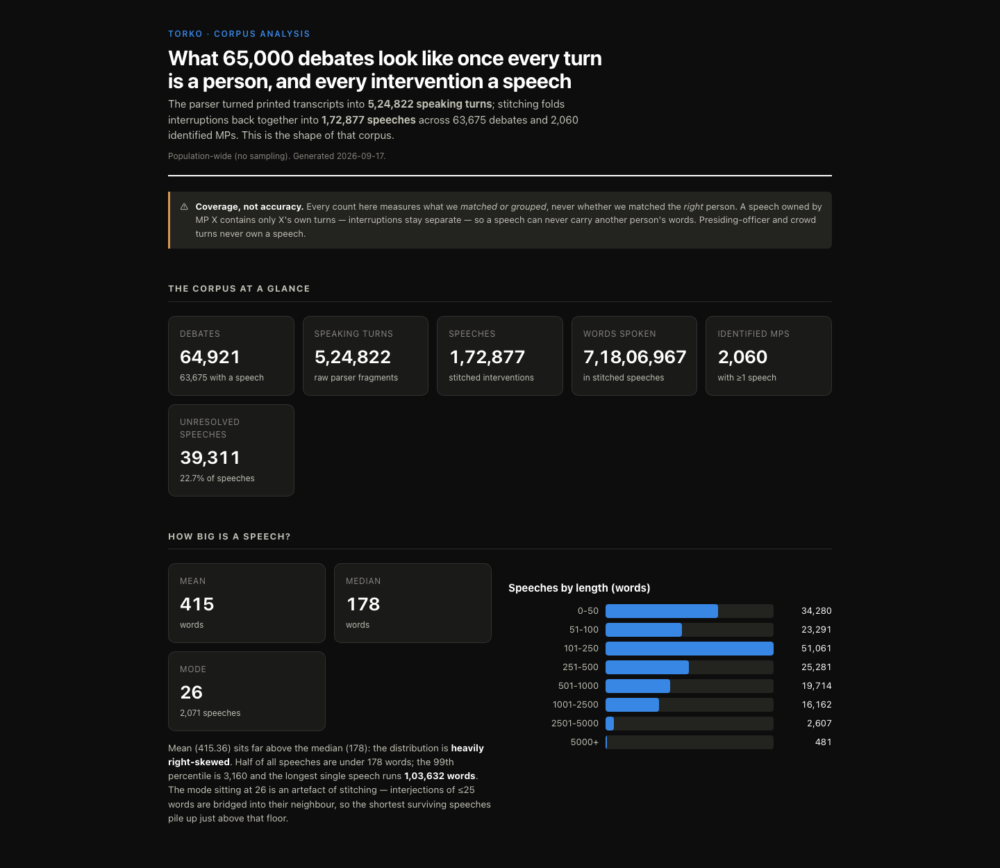

# Torko

Torko lets a user search 64,921 Lok Sabha debates from 1999 to 2026 and find every speech by 2,072 identified members of parliament.


## The problem

The official website, sansad.in, publishes each debate as a separate web page.

The website marks a speaker with an identity number only on their first turn in a debate. Later turns carry only a printed name.

The same person also appears under many spellings, for example `SHRI ADHIR RANJAN CHOWDHURY (BAHARAMPUR)`, `SHRI ADHIR RANJAN CHOWDHURY`, and `श्री अधीर रंजन चौधरी`.

## What Torko does

- Search 26 years of debates by word or by phrase.
- Filter debates by party, by parliament term, by year, and by category.
- Open a member of parliament and read every speech from that member.
- Open the official source page for any speech, with one click.

## Run it

Public demo: coming soon.

Follow these steps to run Torko on your own computer.

```bash
python3 -m venv .venv
source .venv/bin/activate
pip install -r requirements.txt
```

Start the database with this command.

```bash
docker compose up -d
```

### Load the data

The database starts empty. Run these five commands one time, in this order.

```bash
python3 scripts/load_roster.py
python3 -u scripts/import_debates.py
python3 -u scripts/populate_turns.py
python3 -u scripts/populate_speeches.py
python3 scripts/analyze_speeches.py > fixtures/analysis.json
```

The first script loads the member roster from the sansad.in API.
The second script downloads all 64,921 debates.
This step takes under one hour with the default 6 workers.
The third script reads the stored HTML and writes the speaking turns.
The fourth script groups the turns into speeches.
The fifth command rebuilds the data for the corpus statistics page.

Start the web server with this command.

```bash
source .venv/bin/activate && python3 server.py
```

Open the dashboard at this address: http://localhost:5050/dashboard.html

The dashboard needs a loaded PostgreSQL database before it can show any data. PostgreSQL is a system for storing structured data.

Torko also runs from the command line, on a single debate at a time.

```bash
python3 debate_fetch.py --loksabha 18 --session 3 --dbslno 1758
python3 debate_fetch_legacy.py --loksabha 13 --session 14 --dbslno 7793
```

Add the `--summary-only` flag to hide the per-turn previews.

## Screenshots


This image shows the profile page for one member of parliament.


This image shows the corpus statistics page for the full set of debates.

## How it works

1. The reader fetches each debate from the sansad.in API.
2. Torko stores the raw HTML of the debate before it reads any text.
3. The reader extracts each speaking turn and writes it to PostgreSQL.
4. A Flask API, a Python web framework, serves the stored data to the browser.
5. The browser shows the data with plain JavaScript.

Torko is built with Python, PostgreSQL, SQLAlchemy Core, Flask, and plain JavaScript. SQLAlchemy Core is a Python toolkit for writing SQL queries.

Torko stores the raw HTML before it reads any text out of that HTML. This choice means a change to the reading code needs no new network requests. A full re-read of all 64,921 debates takes minutes instead of days.

Two reader files turn HTML into speaking turns. `debate_fetch.py` reads the recent format, used from the 15th to the 18th Lok Sabha. `debate_fetch_legacy.py` reads the old format, used in the 13th and 14th Lok Sabha. Torko detects the correct reader on its own, for each debate.

## Two engineering problems

**Problem 1: the disguised Hindi font.** Old pages store Hindi text in a font that predates Unicode, the modern standard for text encoding. The stored bytes look like broken Latin characters, for example `gÉÉÒ`. A reader that ignores this stores meaningless text while it reports success. Torko builds a character map to convert the bytes into real Hindi text. Torko also builds a detector. The detector decides whether the conversion should run. The detector matters because one early version of the fix once converted correct Hindi text into damaged text.

**Problem 2: one identity across 26 years.** The same person must carry one identity across all 6 parliament terms Torko covers. The source gives a stable identity number only on a speaker's first turn in each debate. Later turns carry just a printed name. Torko carries the identity number forward to later turns by comparing the printed names. Torko records no name when two different people could match the same printed name. A gap is safer than a wrong name.

Torko links all three spellings of Adhir Ranjan Chowdhury's name from the earlier example to one person record. That single record holds 861 debates and 2,397 interventions. It holds 552,048 words in total. The record spans 5 parliament terms, from 1999 to 2024.

## The numbers

| Metric | Value |
|---|---|
| Debates | 64,921 |
| Date range | 20 October 1999 to 18 April 2026 |
| Parliament terms | 6 (the 13th to the 18th Lok Sabha) |
| Speaking turns | 524,822 |
| Stitched speeches | 172,877 |
| Members in the loaded roster | 2,177 |
| Members with at least one attributed turn | 2,072 |
| Total words | 78,253,636 |
| Words linked to a named person | 61,784,759 (79% of total words) |
| Turns with no speaker name | 111,286 |
| Speeches of 100 words or more with a named person | 97,043 |
| Debate categories | 76 |
| Official topic tags | 6,976 distinct tags, on 70.5% of debates |
| Average speech length | 415 words |
| Longest single speech | 103,632 words |
| Debates per term | LS13: 7,616. LS14: 11,027. LS15: 11,216. LS16: 15,831. LS17: 13,272. LS18: 5,959. |

The 79% figure measures the share of words that carry a linked name, out of all 78,253,636 words. It does not measure whether each linked name is the correct person. A user should treat these as two separate measurements.

## Known limits

1. Torko finds no speaker name for 111,286 turns. The dashboard marks these turns as unattributed.
2. The party shown for a member reflects only their final term. A member who changed party shows one party for their whole history.
3. About 13.6% of the source text uses a page layout that the reader does not yet handle. This loss is larger in the older parliament terms.
4. Torko finds leads, not final answers. A researcher must verify every quote at the official source before they cite it.

## Tests

Torko ships 514 tests. The tests run with no network access. The full run takes about 1 second.

```bash
python3 -m pytest
```

## License and contact

License: add a license file here. Contact: add a contact address here.
